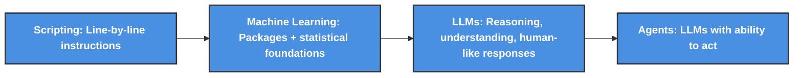

# RAG ChatBot Implementation - Overview 

> Retrieval-Augmented Generation (RAG)

Last updated: 2025-11-12

----------

> `How we move from basic coding all the way to AI agents?`




<details>
<summary><b> More details about it here </b> (Click to expand)</summary>
  
> - We all `start with scripting`, no matter the language, it’s the first step. `Simple/complex instructions, written line by line`, to get something done
> - Then comes `machine learning`. At this stage, we’re not reinventing the math, we’re `leveraging powerful packages built on deep statistical and mathematical foundations.` These tools let us `automate smarter processes, like reviewing claims with predictive analytics. You’re not just coding anymore; you’re building systems that learn and adapt.`
> - `LLMs`. This is what most people mean when they say `AI.` Think of `yourself as the architect, and the LLM as your strategic engine. You can plug into it via an API, a key, or through integrated services. It’s not just about automation, it’s about reasoning, understanding, and generating human-like responses.`
> - And finally, `agents`. These are LLMs with the `ability to act`. They don’t just respond, `they take initiative. They can create code, trigger workflows, make decisions, interact with tools, with other agents. It’s where intelligence meets execution`

</details>

> [!NOTE]
> A landing zone is a general `cloud framework that sets up the core structure for all workloads`. Each use case (like an app, data pipeline, or API) then builds on top of this framework, using the `same environments (Dev → Test → UAT → Prod) and CI/CD pipelines to move code safely into production.` It’s general by design, but `applied per use case.`

<details>
<summary><b>List of References</b> (Click to expand)</summary>
    
- [Azure Updates](https://azure.microsoft.com/en-us/updates/)
- [Connect with partners](https://marketplace.microsoft.com/en-us/marketplace/partner-dir/)
- [Microsoft Docs - Azure resources docs](https://github.com/MicrosoftDocs) - backend specifications
- [Front Door limits](https://github.com/MicrosoftDocs/azure-docs/blob/main/includes/front-door-limits.md)
- [Front Door routing limits](https://learn.microsoft.com/en-us/azure/frontdoor/front-door-routing-limits)
- [GPT-RAG Orchestrator](https://github.com/Azure/gpt-rag-orchestrator) - also in charge of sql on prem/Sharepoint
- `How we managed PII?`
  - [Detect and redact Personally Identifying Information in text](https://learn.microsoft.com/en-us/azure/ai-services/language-service/personally-identifiable-information/how-to/redact-text-pii): If you're building on existing solutions and want to add layers via APIs or SDKs, consider using Azure AI language tools to identify and extract Personally Identifiable Information (PII).
  - [Presidio - Data Protection and De-identification SDK](https://github.com/microsoft/presidio): When you need an `open-source option for detecting and managing sensitive data, Presidio` is a great fit. It can be `integrated into your systems to detect, redact, mask, and anonymize PII across text, images, and structured data.`
  - [How data is protected and audited in Microsoft 365 and Microsoft 365 Copilot](https://learn.microsoft.com/en-us/copilot/microsoft-365/microsoft-365-copilot-architecture-data-protection-auditing): If you're working with Microsoft 365 Copilot and need to understand its data protection model, this overview explains how it handles security and compliance.
  - [Considerations to manage Microsoft 365 Copilot and Channel Agent in Teams for security and compliance](https://learn.microsoft.com/en-us/purview/ai-m365-copilot-considerations): When managing compliance across Copilot deployments, Microsoft Purview offers tools to help govern data securely.
- [Azure Developer CLI commands overview](https://learn.microsoft.com/en-us/azure/developer/azure-developer-cli/azd-commands)
- [Azure Developer CLI (azd)](https://learn.microsoft.com/en-us/azure/developer/azure-developer-cli/)
- [What is PowerShell?](https://learn.microsoft.com/en-us/powershell/scripting/overview?view=powershell-7.5)
- [Integrate Azure services with virtual networks for network isolation](https://learn.microsoft.com/en-us/azure/virtual-network/vnet-integration-for-azure-services)
- [GPT-4 and GPT-4 Turbo models max tokens](https://learn.microsoft.com/en-us/azure/ai-services/openai/concepts/models?tabs=global-standard%2Cstandard-chat-completions#gpt-4-and-gpt-4-turbo-models)
- [GPT-4 and GPT-4 Turbo model availability](https://learn.microsoft.com/en-us/azure/ai-services/openai/concepts/models?tabs=standard%2Cstandard-chat-completions#gpt-4-and-gpt-4-turbo-model-availability)
- [View the service principal for a managed identity using the Azure portal](https://learn.microsoft.com/en-us/entra/identity/managed-identities-azure-resources/how-to-view-managed-identity-service-principal?pivots=identity-mi-service-principal-portal#view-the-service-principal-for-a-managed-identity-using-the-azure-portal)
- [Microsoft.Search searchServices bicep template](https://learn.microsoft.com/en-us/azure/templates/microsoft.search/searchservices?pivots=deployment-language-bicep)
- [Recover/Purge a deleted resource](https://learn.microsoft.com/en-us/azure/ai-services/recover-purge-resources?tabs=azure-portal#recover-a-deleted-resource)
- [TechWorkshop L300: Win the database acceleration](https://microsoft.github.io/TechExcel-Win-the-Database-Platform/)
- [MSFT - Multi-Agent Custom Automation Engine Solution Accelerator](https://github.com/microsoft/Multi-Agent-Custom-Automation-Engine-Solution-Accelerator?tab=readme-ov-file)

</details>

<details>
<summary><b>Table of Content</b> (Click to expand)</summary>

- [Where to start?](#where-to-start)
- [Basic Architecture](#basic-architecture)
  - [Important Considerations for Production Environment](#important-considerations-for-production-environment)
- [Zero Trust Architecture](#zero-trust-architecture)
  - [Step 0.1: Install azd](#step-01-install-azd)
  - [Step 0.2: Install PowerShell 7](#step-02-install-powershell-7)
  - [Step 1: Download the repository](#step-1-download-the-repository)
  - [Step 2: Enable network isolation](#step-2-enable-network-isolation)
  - [Step 3: Login to Azure](#step-3-login-to-azure)
  - [Step 4: Deploy the insfrastructure](#step-4-deploy-the-insfrastructure)
  - [Step 5: VM Login](#step-5-vm-login)
  - [Step 6: Install PowerShell 7 in the vm](#step-6-install-powershell-7-in-the-vm)
  - [Step 7: Update azd on the VM](#step-7-update-azd-on-the-vm)
  - [Step 8: Application deployment](#step-8-application-deployment)

</details>

> In the context of developing an E2E solution or application. Each stage builds confidence (technical, functional, and strategical), until we ready to scale and support the solution in the real world. Think of them as milestones in the journey from idea to production:

`Idea → PoC → PoV → MVP → Dev → Test → UAT → Prod → Continuous Improvement`
> - PoC: Build a minimal version to prove that the `core idea` or `technology can work` → `Infrastructure setup, basic UI, simple workflows, mock data`
> - PoV: Aligns with `business goals and KPIs` → `Stakeholder engagement`
> - MVP: Usable `product with core features` → `Set of features that delivers value and can be deployed` → Dev, Test, UAT (User Acceptance Testing), Prod

<details>
<summary><b>Detailed phases</b> (Click to expand)</summary>
  
| Phase | Goal | What Happens | Focus | Audience | Example |
|-------|------|--------------|-------|----------|---------|
| **PoC (Proof of Concept)** | Validate technical feasibility | Build a minimal version to prove that the core idea or technology can work | Infrastructure setup, basic UI, simple workflows, mock data | Internal tech teams, architects | Can we integrate this new AI model into our system? |
| **PoV (Proof of Value)** | Demonstrate business value | Expand the PoC to show how the solution aligns with business goals and KPIs | Real use cases, measurable outcomes, stakeholder engagement | Business leaders, sponsors, decision-makers | Does this solution reduce processing time by 30% as expected? |
| **MVP (Minimum Viable Product)** | Deliver a usable product with core features | Build the smallest set of features that delivers value and can be deployed | Real users, feedback loops, iterative improvements | Early adopters, pilot users | A working app with login, dashboard, and one key feature |
| **Dev (Development)** | Build and refine the product | Full-scale development of features, integrations, and backend logic | Code quality, version control, collaboration | Developers, QA, product managers | — |
| **Test (System/Integration Testing)** | Ensure the system works as expected | Run automated/manual tests, fix bugs, validate integrations | Functional testing, regression testing, performance | QA teams, developers | — |
| **UAT (User Acceptance Testing)** | Validate with real users before go-live | Business users test the system in a near-production environment | Usability, business rules, edge cases | End users, business analysts, stakeholders | — |
| **Prod (Production)** | Go live and deliver value | Deploy the solution to the live environment for real users | Stability, monitoring, support, feedback | All users, support teams, business owners | — |

> `How we move from basic coding all the way to AI agents?`
>
> - We all `start with scripting`, no matter the language, it’s the first step. `Simple/complex instructions, written line by line`, to get something done
> - Then comes `machine learning`. At this stage, we’re not reinventing the math, we’re `leveraging powerful packages built on deep statistical and mathematical foundations.` These tools let us `automate smarter processes, like reviewing claims with predictive analytics. You’re not just coding anymore; you’re building systems that learn and adapt.`
> - `LLMs`. This is what most people mean when they say `AI.` Think of `yourself as the architect, and the LLM as your strategic engine. You can plug into it via an API/key, or through integrated services. It’s not just about automation, it’s about reasoning, understanding, and generating human-like responses.`
> - And finally, `agents`. These are LLMs with the `ability to act`. They don’t just respond, `they take initiative. They can create code, trigger workflows, make decisions, interact with tools, with other agents. It’s where intelligence meets execution`

</details>

> [!NOTE]
> How to query from `Sharepoint Library`: [GPT-RAG Data Ingestion](https://github.com/Azure/gpt-rag-ingestion/tree/main) 

<details>
<summary><b> Details </b> (Click to expand)</summary>

> - Access & Authentication: Integration uses a `service principal accoun`t registered in Azure Entra ID to authenticate and access the SharePoint document library via Microsoft Graph API. This avoids using personal accounts for programmatic access.
> - Data Ingestion Flow: The RAG system connects to the SharePoint library using the provided credentials, retrieves documents (mainly PDFs), and processes them for indexing.
> - Code Structure: Key integration logic resides in files such as:
>   - Main orchestrator for ingestion of SharePoint files into Azure AI Search: [sharePoint_files_indexer.py](https://github.com/Azure/gpt-rag-ingestion/blob/main/jobs/sharepoint_files_indexer.py) (main orchestrator for indexing)
>     - Streams metadata via Graph API (without loading all at once).
>     - For each file: download, check if changed, chunk, and index.
>     - Tracks total, succeeded, and failed counts, and logs progress every N files.
>     - Uses in-memory tracking of failures for review.
>   - Handles API interaction: [sharePoint.py](https://github.com/Azure/gpt-rag-ingestion/blob/main/tools/sharepoint.py)
>   - Documents are chunked using a `common logic module, not specific to SharePoint`, to prepare data for embedding and indexing: [document_chunking.py](https://github.com/Azure/gpt-rag-ingestion/blob/main/chunking/document_chunking.py)
> - Current Limitation: Only one `SharePoint library is supported at a time, but the code can be extended to support multiple libraries by creating additional indexes.`
> - No Preview Connector: The integration `does not use the AI Foundry SharePoint preview connector; it relies on custom code developed before that connector was available.` 
> - Component Architecture: The `ingestion is handled by a function app, which takes files from SharePoint, converts them into vectors/embeddings, and stores them in the index for search`.

```
SharePoint Site → Metadata Streamer → Document Downloader → Chunker → Azure AI Search

                     ↓

                Deleted Items Checker → Purge Deleted Items
 ```
 
</details>

> [!NOTE]
> How to query from `SQL on prem?`: <br/>

<details>
<summary><b> Details </b> (Click to expand)</summary>
  
> This process `involved converting natural language to SQL, where we integrated the SQL database with the Agentic framework. When a user submits a query from the frontend, the system extracts relevant schema details from the AI search index to generate a SQL query with a few example cases. The query is then executed on the SQL server to fetch the records, and the results are displayed in natural language on the UI using an LLM.`  Here more about how it works: [GPT-RAG Orchestrator](https://github.com/Azure/gpt-rag-orchestrator) 

</details>

> [!IMPORTANT]
> Disclaimer: This repository contains example of a Retrieval-Augmented Generation (RAG) chat bot with a basic architecture (designed for scenarios without network isolation), and a standard Zero-Trust Architecture deployment. This is `just a guide`. It is not an official solution. For official guidance, support, or more detailed information. Please refer [RAG with Zero-Trust – Architecture Reference to Microsoft's official documentation](https://github.com/Azure/GPT-RAG) or contact Microsoft directly: [Microsoft Sales and Support](https://support.microsoft.com/contactus?ContactUsExperienceEntryPointAssetId=S.HP.SMC-HOME)

| [Public Architecture](#basic-architecture)  | [Private Architecture](./1_PrivateArchitecture.md) |  [Standard Zero-Trust Architecture](https://github.com/Azure/GPT-RAG) |
| --- | --- | --- | 
|      |    |  |

<details>
<summary><b>RAG + Fabric (Private Chatbot with your data + Dashboards)</b> (Click to expand)</summary>


</details>

> Here is a [quick overview about RAG](./0_RAG_Overview.md), explaining how it works, its applications, and how to implement it using Azure AI services.

> [!TIP]
>
> - `Batch processing involves uploading files to SharePoint`, where they can be `processed later`. <br/>
> - `Real-time processing`, on the other hand, `would involve users uploading files directly within the app`, which could be stored in a `BLOB storage for immediate processing`.

## Where to start? 

- An `Azure subscription is required`. All other resources, including instructions for creating a Resource Group, are provided.
- `Contributor role assigned or any custom role that allows`: access to manage all resources, and the ability to deploy resources within subscription.

> RAG Solution Accelerators options:

- If you choose to use the [Basic Architecture](#basic-architecture), ([Terraform approach](./terraform-infrastructure/README.md)), please ensure that:
  - [Terraform is installed on your local machine](https://developer.hashicorp.com/terraform/tutorials/azure-get-started/install-cli#install-terraform).
  - [Install the Azure CLI](https://learn.microsoft.com/en-us/cli/azure/install-azure-cli) to work with both Terraform and Azure commands.
- If you opt for the [Zero Trust Architecture](#zero-trust-architecture), (Bicep approach), please ensure that you have installed all the requirements mentioned in the [prerequisites section](https://github.com/Azure/GPT-RAG?tab=readme-ov-file#getting-started) before proceeding.

## Basic Architecture

> Please follow the [Terraform guide](./terraform-infrastructure/README.md) to deploy the necessary Azure resources for the solution.

<div align="center">
  
</div>

### Important Considerations for Production Environment

<details>
<summary>Click to expand</summary>

> Some considerations:

<details>
  <summary>Public Network Site</summary>
  
  > This example is based on a public network site and is intended for demonstration purposes only. It showcases how several Azure resources can work together to achieve the desired result.

</details>

<details>
  <summary>Private Network Configuration</summary>

 > For enhanced security, consider configuring your Azure resources to operate within a private network. This can be achieved using Azure Virtual Network (VNet) to isolate your resources and control inbound and outbound traffic. Implementing private endpoints for services like Azure Blob Storage and Azure Functions can further secure your data by restricting access to your VNet.

</details>

<details>
  <summary>Security</summary>

  > Ensure that you implement appropriate security measures when deploying this solution in a production environment. This includes: <br/>
  >
  > - Securing Access: Use Azure Entra ID (formerly known as Azure Active Directory or Azure AD) for authentication and role-based access control (RBAC) to manage permissions. <br/>
  > - Managing Secrets: Store sensitive information such as connection strings and API keys in Azure Key Vault. <br/>
  > - Data Encryption: Enable encryption for data at rest and in transit to protect sensitive information.

</details>

<details>
  <summary>Scalability</summary>

  > While this example provides a basic setup, you may need to scale the resources based on your specific requirements. Azure services offer various scaling options to handle increased workloads. Consider using: <br/>
  >
  > - Auto-scaling: Configure auto-scaling for Azure Functions and other services to automatically adjust based on demand. <br/>
  > - Load Balancing: Use Azure Load Balancer or Application Gateway to distribute traffic and ensure high availability.

</details>

<details>
  <summary>Cost Management</summary>

  > Monitor and manage the costs associated with your Azure resources. Use Azure Cost Management and Billing to track usage and optimize resource allocation.

</details>

<details>
  <summary>Compliance</summary>

  > Ensure that your deployment complies with relevant regulations and standards. Use Azure Policy to enforce compliance and governance policies across your resources.
</details>

<details>
  <summary>Disaster Recovery</summary>
   
> Implement a disaster recovery plan to ensure business continuity in case of failures. Use Azure Site Recovery and backup solutions to protect your data and applications.

</details>

</details>

## Zero Trust Architecture

> Zero Trust AI architecture in Microsoft Azure is a `security framework designed to protect data, applications, and infrastructure by assuming that threats can come from both inside and outside the network`. This model operates on the principle of "never trust, always verify", meaning `every access request is thoroughly authenticated and authorized based on all available data points, regardless of its origin. The architecture integrates multiple layers of security, including strong identity verification, device compliance checks, and least privilege access, ensuring that only authorized users and devices can access sensitive resources`. By continuously monitoring and validating each request, Zero Trust AI architecture helps organizations minimize risks and enhance their overall security posture.

> [!IMPORTANT]
> Click [here for a more quick guidance about Zero Trust](./2_ZeroTrustOverview.md). For a `solution accelerator with a zero-trust architecture` please refer to [Microsoft's official GPT-RAG Solution Accelerator](https://github.com/Azure/GPT-RAG) or contact Microsoft directly: [Microsoft Sales and Support](https://support.microsoft.com/contactus?ContactUsExperienceEntryPointAssetId=S.HP.SMC-HOME)

<div align="center">
  
</div>

From [Standard Zero-Trust Architecture](https://github.com/Azure/GPT-RAG/blob/main/media/architecture-GPT-RAG-ZeroTrust-LZ.png)

| **Aspect**                | **Details**                                                                 |
|---------------------------|-----------------------------------------------------------------------------|
| **Application Components**| - [Data Ingestion](https://github.com/Azure/gpt-rag-ingestion): Optimizes data chunking and indexing for retrieval. Integrates with SharePoint for document processing. Click [here for more information about the Sharepoint setup](https://github.com/Azure/GPT-RAG/blob/main/docs/INGESTION_SHAREPOINT_SETUP.md). <br> - Orchestrator: Manages retrieval and response generation. [Functional (Semantic Kernel)](https://github.com/Azure/gpt-rag-orchestrator) or [Agentic (AutoGen)](https://github.com/Azure/gpt-rag-agentic). <br> - App Front-End: User interface with [React Front-End](https://github.com/Azure/gpt-rag-frontend) or [Chainlit Front-End](https://github.com/Azure/gpt-rag-ui), following [Backend for Front-End pattern](https://learn.microsoft.com/en-us/azure/architecture/patterns/backends-for-frontends) <br/> - [RAG Security Hub](https://github.com/Azure/gpt-rag-securityhub/tree/main): Secures the RAG stack with Azure AD, Key Vault, and secure deployment practices. Centralizes environment config and vulnerability management.|
| **Batch Processing**      | Handles large datasets in parallel. Ideal for data analysis and content generation. |

> [!NOTE]
> To deploy this solution accelerator, please make sure that you have installed all the requirements mentioned in the [prerequisites section](https://github.com/Azure/GPT-RAG?tab=readme-ov-file#getting-started) before proceeding. Below, you will find visual guidance that complements the [Zero Trust Architecture Deployment](https://github.com/Azure/GPT-RAG?tab=readme-ov-file#zero-trust-architecture-deployment) from the [Microsoft's official GPT-RAG Solution Accelerator](https://github.com/Azure/GPT-RAG).

### Step 0.1: Install azd 

> The Azure Developer CLI (azd) is an `open-source tool` designed to streamline the end-to-end developer workflow on Azure. It provides `high-level commands` that simplify common developer tasks such as `project initialization, infrastructure provisioning, code deployment, and monitoring`. 

<details>
<summary><b> Details </b> (Click to expand)</summary>

> More detailed technical information:
  
<details>
<summary><strong>Key Features</strong></summary>

- High-level commands for common developer tasks
- Integration with azd templates
- Support for terminal, IDE, and CI/CD pipelines
- Developer-friendly commands mapping to key workflow stages
- Supported Languages: C#, Java, Node.js, Python
- Integration: Terminal, IDE (Integrated Development Environment), GitHub Actions pipeline
- **Command Line Interface (CLI)**: azd provides a streamlined CLI experience for developers, enabling quick execution of tasks without needing to navigate complex Azure interfaces.
- **Template Management**: azd templates are designed to be easily customizable, allowing developers to adapt them to specific project requirements.
- **CI/CD Integration**: azd supports integration with popular CI/CD tools, facilitating automated deployment and testing workflows.

</details>

<details>
<summary><strong>Commands Overview</strong></summary>

- **Initialization (`azd init`)**: Initialize a new project; sets up the project structure, including necessary configuration files and directories.
- **Provisioning (`azd provision`)**: Provision multiple Azure resources; automates the creation of Azure resources such as virtual machines, databases, and storage accounts.
- **Deployment (`azd deploy`)**: Handles the deployment of application code to Azure, ensuring that all dependencies and configurations are correctly applied.
- **Monitoring (`azd monitor`)**: Provides tools for tracking the performance and health of deployed resources, integrating with Azure Monitor and Application Insights.

</details>

<details>
<summary><strong>Comparison with Other Tools</strong></summary>

- **Azure CLI**: Provides granular control over individual Azure resources; ideal for detailed management of Azure resources, offering extensive command options for precise control.
- **Azure PowerShell**:Similar to Azure CLI but uses PowerShell cmdlets; leverages PowerShell scripting capabilities for Azure management, suitable for users familiar with PowerShell syntax.
- **azd**:  Automates higher-level development tasks; focuses on simplifying the overall development workflow, reducing the complexity of managing multiple Azure services.

</details>

<details>
<summary><strong>Templates</strong></summary>

- **Project Structure**: azd templates follow a standardized structure, making it easier for developers to understand and navigate the project.
- **Sample Code**: Templates include sample application code to demonstrate best practices and provide a starting point for development.
- **Infrastructure Files**: Templates come with predefined infrastructure files, such as ARM templates or Terraform scripts, to streamline resource provisioning.
- **Configuration Management**: The `.azure` folder contains essential configuration files for managing Azure settings and secrets.

</details>

<details>
<summary><strong>Customization</strong></summary>

- **Use Terraform with azd**: Allows developers to use Terraform for infrastructure management, providing a consistent approach to resource provisioning; integrate Terraform scripts within azd workflows to manage infrastructure as code, allowing for consistent and repeatable deployments across different environments.
- **Customize workflows using hooks**: Custom hooks enable developers to execute specific actions at various points in the deployment process, enhancing flexibility and control.; implement custom scripts or commands at various stages of the azd workflow (e.g., pre-deploy, post-deploy) to tailor the deployment process to specific project needs.
- **Manage environment variables**: Define and manage environment variables within azd to configure application settings and secrets, ensuring consistent behavior across different deployment environments.
- **Remote environment support**: Use azd to manage and deploy applications to remote environments, facilitating development and testing across geographically distributed teams and resources.

</details>

<https://github.com/user-attachments/assets/2a9d7c6b-1260-4ad1-8889-ce01057d2b44>

</details>

### Step 0.2: Install PowerShell 7

> PowerShell 7 `complements Azure Developer CLI (azd) by providing robust automation capabilities that enhance the development and deployment workflows on Azure`. With PowerShell 7, you can `automate tasks such as provisioning resources, deploying applications, and managing configurations, which are integral to azd's operations.` For instance, you can use PowerShell scripts to automate the azd provision command, ensuring consistent infrastructure setup across different environments. PowerShell 7's ability to execute commands remotely aligns with azd's remote environment support, allowing seamless management of Azure resources from any location. By integrating PowerShell 7 scripts into azd workflows, developers can streamline their processes, improve efficiency, and maintain greater control over their Azure deployments.

<details>
<summary><b> Visual reference here </b> (Click to expand)</summary>

<https://github.com/user-attachments/assets/9bb475e4-7fef-46d9-9147-a28e806b4e1c>

</details>

### Step 1: Download the repository

<details>
<summary><b> Details </b> (Click to expand)</summary>

> Standard orchestrator

  ```
  azd init -t azure/gpt-rag
  ```

> Add -b agentic if you want to use the Agentic AutoGen-based orchestrator

  ```
  azd init -t azure/gpt-rag -b agentic
  ```

<https://github.com/user-attachments/assets/22d2c66b-fd1e-4967-9f6c-ae02e27b2036>

</details>

> [!IMPORTANT]
> Update the information in the `GPT-RAG_SolutionAccelerator/infra/main.parameters.json` file, and make sure to save your changes before proceeding with the infrastructure deployment.

### Step 2: Enable network isolation

> Azure network isolation is a security strategy that segments a network into distinct subnets or segments, each functioning as its own small network. This approach enhances security by preventing unauthorized access and data leakage. In Azure, network isolation can be achieved using Virtual Networks (VNets), Network Security Groups (NSGs), and Private Link, allowing precise control over inbound and outbound traffic.

<details>
<summary><b> Details </b> (Click to expand)</summary>

  ```
  azd env set AZURE_NETWORK_ISOLATION true  
  ```

<https://github.com/user-attachments/assets/4f493506-970d-4b1d-aee2-1b0972a365d7>

</details>

### Step 3: Login to Azure

<details>
<summary><b> Details </b> (Click to expand)</summary>

> Make sure you log in to both:

1. Azure Developer CLI: 
      
      ```
      azd auth login
      ```

2. Azure CLI:

      ```
      az login
      ```

<https://github.com/user-attachments/assets/ed8833ee-5edc-4d28-8b45-2d6ae75e2bf6>

</details>

### Step 4: Deploy the insfrastructure

> `azd provision` command in Azure Developer CLI (azd) automates the deployment of necessary Azure resources for an application. It uses infrastructure-as-code templates to set up Azure services, ensuring consistent and repeatable deployments across different environments.

<details>
<summary><b> Details </b> (Click to expand)</summary>

  ```
  azd provision
  ```

<https://github.com/user-attachments/assets/015d2e96-978f-4606-beac-e25f03253585>

> Once it is finished, you will see something like this:

<div align="center">
  
</div>

<div align="center">
  
</div>

</details>

### Step 5: VM login

> AI/Data Science VM

<details>
<summary><b> Details </b> (Click to expand)</summary>

1. To proceed with the deployment, use the Virtual Machine connected via Bastion (set up in step 4).

     

2. Log into the VM using the username and authenticate with the `password stored in the keyvault`, as illustrated in the figure below.

   <https://github.com/user-attachments/assets/6b927de3-d54d-43b0-8fb1-7c0998827714>

   <https://github.com/user-attachments/assets/25ec1fb6-d999-41e4-ac17-0c16b14a946d>

</details>

### Step 6: Install PowerShell 7 in the vm

<details>
<summary><b> Details </b> (Click to expand)</summary>

> After logging into Windows, [install PowerShell](https://learn.microsoft.com/en-us/powershell/scripting/install/installing-powershell-on-windows?view=powershell-7.4#installing-the-msi-package), as all other necessary components are already set up on the VM.

<https://github.com/user-attachments/assets/c089a26e-8b31-466b-a052-a05d73d488fb>

</details>

### Step 7: Update azd on the VM

<details>
<summary><b> Details </b> (Click to expand)</summary>

> Launch the `Command Prompt` and enter the following command to update azd to its latest version:

  ```
  choco upgrade azd  
  ```

  <https://github.com/user-attachments/assets/777cdd6e-fa8f-49c2-9398-f94ac45be711>

</details>

### Step 8: Application deployment

<details>
<summary><b> Details </b> (Click to expand)</summary>

> Please review these configurations: <br/>
>
> - RemoteFX USB Device Redirection: Allows USB devices connected to your local computer to be used in the remote desktop session.`You can access and use local USB devices like storage drives, printers, or other peripherals directly from the remote session.` <br/>
> - Prompt for Credentials on the Client Computer: This setting ensures that users are prompted to enter their login credentials (username and password) on their local computer before they connect to the Remote Desktop Session Host server. `By entering credentials on the local computer, users are providing their login information in a trusted environment. This reduces the risk of credential theft or interception that might occur if credentials were entered on the remote server.` <br/>
> - Configure Server Authentication for Client: This setting controls how the client (your local computer) handles authentication when connecting to the Remote Desktop Session Host server. It ensures that the client verifies the server's identity before establishing a connection. `It provides users with confidence that their remote desktop session is secure and that they are connecting to the correct server.`

  <div align="center">
    
  </div>
  
  <https://github.com/user-attachments/assets/daf3df9d-8c77-42b8-9b84-6728ef4a3332>

1. Create a new folder, for example `deploy` as mentioned in the [official guide](https://github.com/Azure/GPT-RAG?tab=readme-ov-file#zero-trust-architecture-deployment)
2. Once you've created the folder, go ahead and jump into it.

      ```
      mkdir deploy  
      cd deploy
      ```

    <https://github.com/user-attachments/assets/8ea84df0-ac9a-4cad-be91-bfb24548d1d1>

> When executing the `azd init for the app` and `azd env refresh` commands, ensure that the `environment name, subscription, and region are consistent` with those used during the `initial infrastructure provisioning`.

3. Sets up a new project using the Azure GPT-RAG template: `azd init -t azure/gpt-rag`
  
    <https://github.com/user-attachments/assets/094a0830-2a33-42ae-821c-b8ae199fd772>

4. Logs you into Azure Developer CLI: `azd auth login`.

> Ensure your admin account is correctly configured with Authenticator.

  <https://github.com/user-attachments/assets/f34a13eb-b045-40c9-8f99-edc4dc9d0d15>

5. Logs you into your Azure account: `az login`

    <https://github.com/user-attachments/assets/bfe9d038-4503-447e-b251-8da67bc0258a>

6. Updates your environment settings with the latest configuration: `azd env refresh`

      ```powershell
        PS C:\Users\vm-user\Downloads\RAG-ChatBot-Implementation\GPT-RAG_SolutionAccelerator\deploy> azd env refresh
        
        Refreshing environment gptbrowntest (azd env refresh)
        
        ? Select an Azure Subscription to use:  1. ME-timnab-1 (8237827342e0-9348)
          (✓) Done: Retrieving Azure deployment (gptbrowntest-1745337566)
          (✓) Done: Updated 63 environment variables
        
        Populated environment from Azure infrastructure deployment: gptbrowntest-1747566
        
        SUCCESS: Environment refresh completed
        View environment variables at C:\Users\vm-user\Downloads\RAG-ChatBot-Implementation\GPT-RAG_SolutionAccelerator\deploy\.azure\gptbrowntest\.env
      ```
    
      <https://github.com/user-attachments/assets/4c3337e0-514c-4ad5-8324-e911d9542496>

8. Builds and packages your application code into deployable artifacts without deploying them to Azure: `azd package`

    > For example: 
  
    <div align="center">
      
    </div>

9. Deploys your project to Azure: `azd deploy`

    <https://github.com/user-attachments/assets/aa248d9b-b1eb-42e3-9e6c-5e41bfdf5484>

> **If you find an error with `azd deploy`:** 

```
ERROR: getting target resource: getting default resource groups for environment:
gpt-rag-resource-group: resource not found: 0 resource groups with prefix or suffix with value: 'gpt-rag-resource-group'
```

  <div align="center">
    
  </div>

> Please follow these steps to troubleshoot: <br/>
>
> - Review the `infra/main.parameters.json` file for missing or incorrect values.  
> - Run `az account show` to confirm you're logged into the correct Azure subscription.  
> - Run `azd env list` to check available environments.  
> - Run `azd env get-values` and make sure the values match those in `main.parameters.json`.  
> - Optionally, run `azd deploy --verbose` for more detailed error output.  
> For example: <br/>  
> If `main.parameters.json` contains `"location": "westus2"`, make sure your environment has `AZURE_LOCATION=westus2`.

</details>

> [!NOTE]
> A `golden dataset` for RAG is your trusted `curated set of documents or files that the system retrieves from when answering questions`. It’s a clean, accurate, and `representative subset of all possible data free of noise and errors`, so the model always pulls reliable context. Is a `subset of files, for example, and known Q&A pairs chosen from the larger data source.` These are the “benchmark” `questions where the correct answers are already known`, so they can be `used later to measure system accuracy and performance`. Other `expert users are free to ask additional questions during testing, but those will still pull context from the same curated files in the golden dataset (subset datasource)`. In short, it’s the trusted evaluation set for your proof of concept for example.


